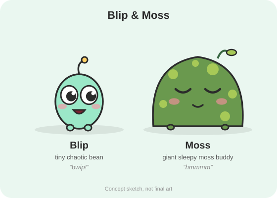
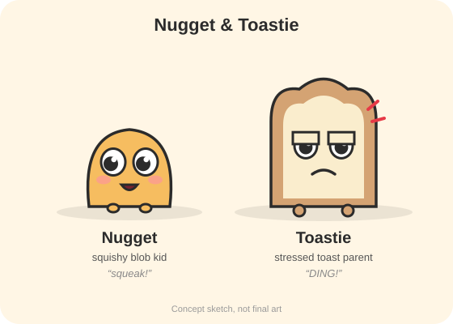
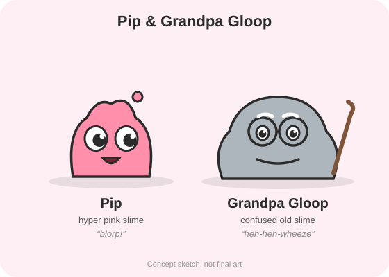
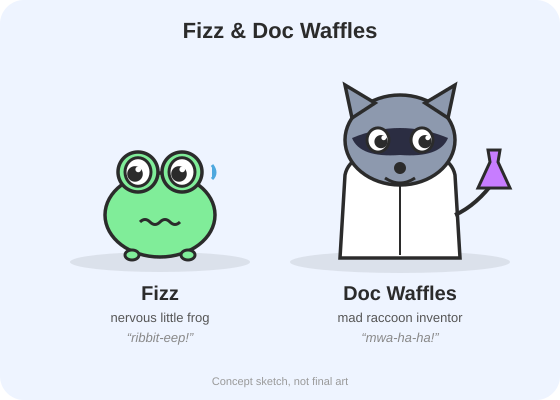
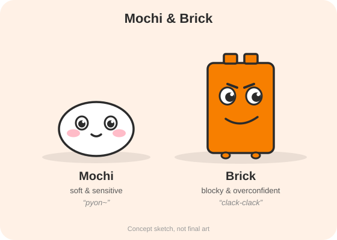
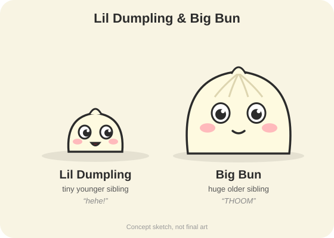
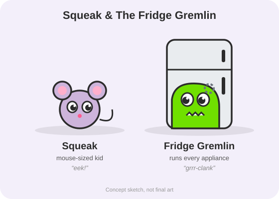
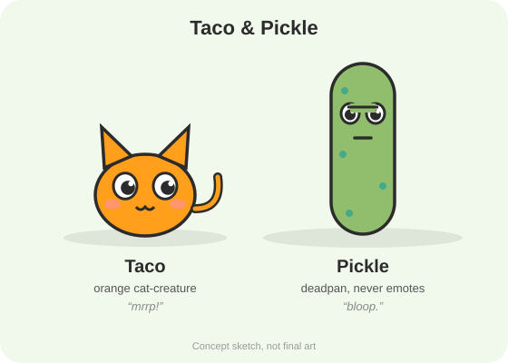

# Character Duos and 30 Video Ideas

*Built from the live data in `capybluh-niche-report.md`. The ideas focus on the formats where small channels are breaking out right now ("How X works" and "2000 vs 2026 vs 2050"), then move into the bigger relatable formats. I left out topics Capybluh has already done (printer, toast, fridge, vending machine, door, alarm, cleaning, Cheetos) so you aren't copying them head-on.*

---

## Part 1: Character duos (pick one)

Every duo follows the same rule: **one chaotic character + one calm or long-suffering one.** That contrast is where the comedy comes from. All of them are faceless, need little or no dialogue, and use simple shapes that are quick to animate.

| # | Duo | Look | Personality and dynamic | Signature sounds | Best formats |
|---|---|---|---|---|---|
| 1 | **Blip & Moss** | Blip: a small, round, mint-green bean with huge eyes. Moss: a giant, fluffy, slow-blinking moss-covered creature (your "capybara") | Blip is pure chaos and impulse; Moss is unbothered, sleepy and secretly heroic | Blip: a high "bwip!" Moss: a deep, slow "hmmmm" | Every format. **The safest, most flexible pick** |
| 2 | **Nugget & Toastie** | Nugget: a squishy, golden blob kid. Toastie: a square slice of toast with tiny legs who acts as the mom or dad | A kid vs a stressed-out parent figure. Built for the mom/dad and "parents see vs I see" formats | Nugget: a squeaky toy. Toastie: a toaster "ding!" when angry | Mom vs Dad, Parents see vs I see |
| 3 | **Pip & Grandpa Gloop** | Pip: a hyperactive pink slime. Grandpa Gloop: an old, grey, droopy slime with glasses | New generation vs old school. Grandpa is always confused by modern tech | Pip: "blorp!" Gloop: a slow, creaky wheeze-laugh | **2000 vs 2026 vs 2050**, Types of people |
| 4 | **Fizz & Doc Waffles** | Fizz: a tiny, anxious frog. Doc Waffles: a raccoon "scientist" in a lab coat | A mad inventor and his nervous assistant, who ends up inside every machine | Fizz: a nervous "ribbit-eep." Doc: an evil-genius cackle | **How X works** (they work inside machines) |
| 5 | **Mochi & Brick** | Mochi: a white, round, mochi-like creature. Brick: a blocky, square, orange creature (with a Roblox-adjacent feel, but your own design) | Soft vs blocky. Mochi is wholesome and sensitive; Brick is overconfident and clumsy | Mochi: a soft "pyon." Brick: a plastic "clack-clack" walk | All formats; emotional videos |
| 6 | **Lil Dumpling & Big Bun** | Two steamed-bun siblings: one tiny, one huge | Younger vs older sibling: rivalry plus secret love | Lil: a tiny "hehe." Big: a heavy "THOOM" step | Mom vs Dad, sibling skits, emotional |
| 7 | **Squeak & The Fridge Gremlin** | Squeak: a mouse-sized kid creature. Gremlin: a green blob that lives inside the house's appliances | A "monster under the house" who is actually doing all the household jobs | Gremlin: a mechanical grumble, gear clanks | **How X works**, Parents see vs I see |
| 8 | **Taco & Pickle** | Taco: a little orange cat-like creature. Pickle: a long, green, deadpan creature | Food-themed, deadpan best friends. Pickle never changes facial expression | Taco: a meow-squeak. Pickle: a single flat "bloop" | Types of people, relatable humor |

### Character concept sheets

Here are first-pass sketches of each duo, showing shape, color and personality. Use them as a reference when you create the final 3D or 2D versions in Google Flow (prompts below) or your animation tool.

<table>
<tr><td></td><td></td></tr>
<tr><td></td><td></td></tr>
<tr><td></td><td></td></tr>
<tr><td></td><td></td></tr>
</table>

### Google Flow prompts (to make the final characters)

**How to use these in Google Flow:**
1. Create a new project and generate each character **on its own** first (image mode), using the prompt for that character plus the style line.
2. Pick the best image and save it as an **ingredient** or reference for that character.
3. For videos, use both characters' saved references together, so they look the same in every clip.
4. Keep the style line identical for every character so the whole cast matches.

**Style line (add to every prompt):**
> Style: cute and slightly weird 3D cartoon character, soft rounded shapes, clean bold outline feel, smooth clay-like materials, bright saturated colors, soft studio lighting, simple pastel background, full body, front view, expressive face, made for YouTube Shorts mascots, no text, no logos.

<b>Blip & Moss</b>

- **Blip:** a tiny mint-green bean-shaped creature with huge glossy black eyes, a single antenna with a yellow ball tip, rosy cheeks, a wide open excited smile, two stubby legs. Style: cute and slightly weird 3D cartoon character, soft rounded shapes, clean bold outline feel, smooth clay-like materials, bright saturated colors, soft studio lighting, simple pastel background, full body, front view, expressive face, made for YouTube Shorts mascots, no text, no logos.
- **Moss:** a giant dome-shaped fluffy creature covered in soft green moss with lighter lime moss spots, sleepy half-closed eyes, a gentle tiny smile, rosy cheeks, a small sprout leaf on top, tiny stubby feet. Style: cute and slightly weird 3D cartoon character, soft rounded shapes, clean bold outline feel, smooth clay-like materials, bright saturated colors, soft studio lighting, simple pastel background, full body, front view, expressive face, made for YouTube Shorts mascots, no text, no logos.
- **Together (for the channel banner and thumbnails):** Blip (a tiny mint-green bean-shaped creature with huge glossy black eyes, a single antenna with a yellow ball tip, rosy cheeks, a wide open excited smile, two stubby legs) standing next to Moss (a giant dome-shaped fluffy creature covered in soft green moss with lighter lime moss spots, sleepy half-closed eyes, a gentle tiny smile, rosy cheeks, a small sprout leaf on top, tiny stubby feet), both looking at the camera, playful pose. Style: cute and slightly weird 3D cartoon character, soft rounded shapes, clean bold outline feel, smooth clay-like materials, bright saturated colors, soft studio lighting, simple pastel background, full body, front view, expressive face, made for YouTube Shorts mascots, no text, no logos.

<b>Nugget & Toastie</b>

- **Nugget:** a small squishy golden-yellow blob creature shaped like a gumdrop, big glossy eyes, rosy cheeks, an open happy mouth, two tiny feet. Style: cute and slightly weird 3D cartoon character, soft rounded shapes, clean bold outline feel, smooth clay-like materials, bright saturated colors, soft studio lighting, simple pastel background, full body, front view, expressive face, made for YouTube Shorts mascots, no text, no logos.
- **Toastie:** a tall slice of toast character with a golden crust border and a cream-colored face, tired heavy-lidded eyes, a worried frown, tiny legs, a small red anger mark near its head. Style: cute and slightly weird 3D cartoon character, soft rounded shapes, clean bold outline feel, smooth clay-like materials, bright saturated colors, soft studio lighting, simple pastel background, full body, front view, expressive face, made for YouTube Shorts mascots, no text, no logos.
- **Together (for the channel banner and thumbnails):** Nugget (a small squishy golden-yellow blob creature shaped like a gumdrop, big glossy eyes, rosy cheeks, an open happy mouth, two tiny feet) standing next to Toastie (a tall slice of toast character with a golden crust border and a cream-colored face, tired heavy-lidded eyes, a worried frown, tiny legs, a small red anger mark near its head), both looking at the camera, playful pose. Style: cute and slightly weird 3D cartoon character, soft rounded shapes, clean bold outline feel, smooth clay-like materials, bright saturated colors, soft studio lighting, simple pastel background, full body, front view, expressive face, made for YouTube Shorts mascots, no text, no logos.

<b>Pip & Grandpa Gloop</b>

- **Pip:** a hyperactive bubblegum-pink slime creature with a wobbly drippy top, huge glossy eyes, a wide open grin, a small slime droplet floating above it. Style: cute and slightly weird 3D cartoon character, soft rounded shapes, clean bold outline feel, smooth clay-like materials, bright saturated colors, soft studio lighting, simple pastel background, full body, front view, expressive face, made for YouTube Shorts mascots, no text, no logos.
- **Grandpa Gloop:** an old droopy grey slime creature with round wire glasses, white bushy eyebrows, a calm confused smile, leaning on a small wooden walking cane. Style: cute and slightly weird 3D cartoon character, soft rounded shapes, clean bold outline feel, smooth clay-like materials, bright saturated colors, soft studio lighting, simple pastel background, full body, front view, expressive face, made for YouTube Shorts mascots, no text, no logos.
- **Together (for the channel banner and thumbnails):** Pip (a hyperactive bubblegum-pink slime creature with a wobbly drippy top, huge glossy eyes, a wide open grin, a small slime droplet floating above it) standing next to Grandpa Gloop (an old droopy grey slime creature with round wire glasses, white bushy eyebrows, a calm confused smile, leaning on a small wooden walking cane), both looking at the camera, playful pose. Style: cute and slightly weird 3D cartoon character, soft rounded shapes, clean bold outline feel, smooth clay-like materials, bright saturated colors, soft studio lighting, simple pastel background, full body, front view, expressive face, made for YouTube Shorts mascots, no text, no logos.

<b>Fizz & Doc Waffles</b>

- **Fizz:** a small nervous lime-green frog with big bulging eyes on top of its head, a wobbly worried mouth, a single sweat drop, tiny feet. Style: cute and slightly weird 3D cartoon character, soft rounded shapes, clean bold outline feel, smooth clay-like materials, bright saturated colors, soft studio lighting, simple pastel background, full body, front view, expressive face, made for YouTube Shorts mascots, no text, no logos.
- **Doc Waffles:** a raccoon mad scientist in a white lab coat, grey fur with a dark eye mask, sneaky smile, holding a bubbling purple potion flask. Style: cute and slightly weird 3D cartoon character, soft rounded shapes, clean bold outline feel, smooth clay-like materials, bright saturated colors, soft studio lighting, simple pastel background, full body, front view, expressive face, made for YouTube Shorts mascots, no text, no logos.
- **Together (for the channel banner and thumbnails):** Fizz (a small nervous lime-green frog with big bulging eyes on top of its head, a wobbly worried mouth, a single sweat drop, tiny feet) standing next to Doc Waffles (a raccoon mad scientist in a white lab coat, grey fur with a dark eye mask, sneaky smile, holding a bubbling purple potion flask), both looking at the camera, playful pose. Style: cute and slightly weird 3D cartoon character, soft rounded shapes, clean bold outline feel, smooth clay-like materials, bright saturated colors, soft studio lighting, simple pastel background, full body, front view, expressive face, made for YouTube Shorts mascots, no text, no logos.

<b>Mochi & Brick</b>

- **Mochi:** a soft round white mochi-like creature, small dot eyes, pink blush cheeks, a tiny content smile, slightly squished shape. Style: cute and slightly weird 3D cartoon character, soft rounded shapes, clean bold outline feel, smooth clay-like materials, bright saturated colors, soft studio lighting, simple pastel background, full body, front view, expressive face, made for YouTube Shorts mascots, no text, no logos.
- **Brick:** a tall blocky orange rectangular creature with two small square studs on top like a toy brick, determined angled eyebrows, a confident grin, short legs. Style: cute and slightly weird 3D cartoon character, soft rounded shapes, clean bold outline feel, smooth clay-like materials, bright saturated colors, soft studio lighting, simple pastel background, full body, front view, expressive face, made for YouTube Shorts mascots, no text, no logos.
- **Together (for the channel banner and thumbnails):** Mochi (a soft round white mochi-like creature, small dot eyes, pink blush cheeks, a tiny content smile, slightly squished shape) standing next to Brick (a tall blocky orange rectangular creature with two small square studs on top like a toy brick, determined angled eyebrows, a confident grin, short legs), both looking at the camera, playful pose. Style: cute and slightly weird 3D cartoon character, soft rounded shapes, clean bold outline feel, smooth clay-like materials, bright saturated colors, soft studio lighting, simple pastel background, full body, front view, expressive face, made for YouTube Shorts mascots, no text, no logos.

<b>Lil Dumpling & Big Bun</b>

- **Lil Dumpling:** a tiny cream-colored steamed dumpling creature with a pleated pinched top, small glossy eyes, rosy cheeks, a happy open mouth. Style: cute and slightly weird 3D cartoon character, soft rounded shapes, clean bold outline feel, smooth clay-like materials, bright saturated colors, soft studio lighting, simple pastel background, full body, front view, expressive face, made for YouTube Shorts mascots, no text, no logos.
- **Big Bun:** a huge cream-colored steamed bun creature with soft pleat lines on top, big gentle eyes, rosy cheeks, a calm kind smile. Style: cute and slightly weird 3D cartoon character, soft rounded shapes, clean bold outline feel, smooth clay-like materials, bright saturated colors, soft studio lighting, simple pastel background, full body, front view, expressive face, made for YouTube Shorts mascots, no text, no logos.
- **Together (for the channel banner and thumbnails):** Lil Dumpling (a tiny cream-colored steamed dumpling creature with a pleated pinched top, small glossy eyes, rosy cheeks, a happy open mouth) standing next to Big Bun (a huge cream-colored steamed bun creature with soft pleat lines on top, big gentle eyes, rosy cheeks, a calm kind smile), both looking at the camera, playful pose. Style: cute and slightly weird 3D cartoon character, soft rounded shapes, clean bold outline feel, smooth clay-like materials, bright saturated colors, soft studio lighting, simple pastel background, full body, front view, expressive face, made for YouTube Shorts mascots, no text, no logos.

<b>Squeak & The Fridge Gremlin</b>

- **Squeak:** a tiny lavender mouse-like kid creature with big round pink-lined ears, big curious eyes, a little pink nose, a curly tail. Style: cute and slightly weird 3D cartoon character, soft rounded shapes, clean bold outline feel, smooth clay-like materials, bright saturated colors, soft studio lighting, simple pastel background, full body, front view, expressive face, made for YouTube Shorts mascots, no text, no logos.
- **The Fridge Gremlin:** a bright green blob gremlin peeking out of an open white refrigerator, zig-zag toothy grin, mischievous eyes, a small gear stuck on its head. Style: cute and slightly weird 3D cartoon character, soft rounded shapes, clean bold outline feel, smooth clay-like materials, bright saturated colors, soft studio lighting, simple pastel background, full body, front view, expressive face, made for YouTube Shorts mascots, no text, no logos.
- **Together (for the channel banner and thumbnails):** Squeak (a tiny lavender mouse-like kid creature with big round pink-lined ears, big curious eyes, a little pink nose, a curly tail) standing next to The Fridge Gremlin (a bright green blob gremlin peeking out of an open white refrigerator, zig-zag toothy grin, mischievous eyes, a small gear stuck on its head), both looking at the camera, playful pose. Style: cute and slightly weird 3D cartoon character, soft rounded shapes, clean bold outline feel, smooth clay-like materials, bright saturated colors, soft studio lighting, simple pastel background, full body, front view, expressive face, made for YouTube Shorts mascots, no text, no logos.

<b>Taco & Pickle</b>

- **Taco:** a round orange cat-like creature with big pointy ears, big glossy eyes, a "w"-shaped cat mouth, a curled tail. Style: cute and slightly weird 3D cartoon character, soft rounded shapes, clean bold outline feel, smooth clay-like materials, bright saturated colors, soft studio lighting, simple pastel background, full body, front view, expressive face, made for YouTube Shorts mascots, no text, no logos.
- **Pickle:** a tall green pickle creature with darker bumps, completely deadpan half-lidded eyes and a flat straight mouth, never changing expression. Style: cute and slightly weird 3D cartoon character, soft rounded shapes, clean bold outline feel, smooth clay-like materials, bright saturated colors, soft studio lighting, simple pastel background, full body, front view, expressive face, made for YouTube Shorts mascots, no text, no logos.
- **Together (for the channel banner and thumbnails):** Taco (a round orange cat-like creature with big pointy ears, big glossy eyes, a "w"-shaped cat mouth, a curled tail) standing next to Pickle (a tall green pickle creature with darker bumps, completely deadpan half-lidded eyes and a flat straight mouth, never changing expression), both looking at the camera, playful pose. Style: cute and slightly weird 3D cartoon character, soft rounded shapes, clean bold outline feel, smooth clay-like materials, bright saturated colors, soft studio lighting, simple pastel background, full body, front view, expressive face, made for YouTube Shorts mascots, no text, no logos.

**Video prompt template (for Flow's video mode, 9:16 vertical):**
> Vertical 9:16 short. [Character A reference] and [Character B reference] in [setting]. [Action beat 1]. [Action beat 2]. [Punchline beat]. Cute 3D cartoon style, exaggerated squash-and-stretch, comedic timing, soft lighting, no dialogue, no text.

Add sound effects and music in your editor afterward (see the "Key sounds" column for each idea), so you control the timing of every gag.

**My recommendation:** go with **#1 Blip & Moss** (closest to the proven Capybluh dynamic, flexible and very merch-friendly) or **#4 Fizz & Doc Waffles** (a natural fit for "How X works," the format most open to newcomers). Below, the ideas use **Kid** (the chaotic character) and **Buddy** (the calm or parent character), so they work with whichever duo you choose.

**Character design checklist:**
- The silhouette is recognizable at thumbnail size.
- Use 1–2 bold colors per character.
- Big expressive eyes.
- Each character always has the same signature sound.
- No real brands or Roblox assets, so the characters are 100% yours.

---

## Part 2: 30 video ideas

**Video structure for every idea:** a hook in the first 1–2 seconds → setup → escalation → absurd or heartfelt payoff → an ending that loops back to the start. **Length:** 15–35 seconds. **Titles:** short, as in the data. Reuse the same title for sequels.

### Series A: "How X works" (cartoon inside the machine). The most open format (78% small channels)

| # | Title | Concept: hook → payoff | Key sounds |
|---|---|---|---|
| 1 | **How a gumball machine works** | A coin drops in → Kid, inside, chooses a gumball, licks it and polishes it → shoots it down a slide → it lands on Buddy's head | Coin clink, a rolling marble, a "pop" |
| 2 | **How a claw machine works** | The claw grabs a plush → Kid inside the claw deliberately loosens it at the last second while laughing → the reveal: a sign reading "Never Win Department" | Mechanical whirr, an evil giggle, a sad trombone |
| 3 | **How a microwave works** | Food goes in → Kid and Buddy spin the plate by hand on a hamster wheel and use hair dryers to heat it → it beeps 3 times and they collapse | A hum, a hamster wheel squeak, BEEP BEEP BEEP |
| 4 | **How the ATM works** (data: 34.6M on a similar title) | A card goes in → Kid frantically counts bills, licking his thumb → the balance comes up as $3.12 → Kid throws in one coin and a sympathy cookie | Cash counting, keypad beeps, a sad violin |
| 5 | **How a washing machine works** | Clothes go in → Kid and Buddy scrub them, go down a waterslide inside and spin like a theme-park ride → they steal one sock each time (the solution to the missing-sock mystery) | Splashes, a rollercoaster scream, a sneaky tiptoe |
| 6 | **How the popcorn machine works** | Kernels arrive → Kid scares each kernel until it "pops" in fright | Jump-scare sting + POP, crowd cheering |
| 7 | **How a coffee machine works** | A button is pressed → Buddy, half-asleep, squeezes coffee beans by hand → Kid throws in 47 sugar cubes → the customer's eyes vibrate | Grinding, drips, a hyper heartbeat |
| 8 | **How the escalator works** | People ride up → underneath, Kid and Buddy run on a giant treadmill carrying the steps → someone presses the stop button and they fly off | Footsteps, panting, a squeal + crash |

### Series B: "X 2000 vs 2026 vs 2050". Open format, 17 breakouts in 90 days

| # | Title | 2000 → 2026 → 2050 | Key sounds |
|---|---|---|---|
| 9 | **Lunchbox 2000 vs 2026 vs 2050** | A sandwich and juice box → a bento box with a QR code → a pill that becomes a full Thanksgiving dinner | A crinkle, a phone ding, a magic "fwoosh" |
| 10 | **Birthday party 2000 vs 2026 vs 2050** | A homemade cake and party hats → everyone filming on phones → a hologram cake that you can't eat (Kid cries) | A party horn, camera shutters, a sad hologram fizz |
| 11 | **Video games 2000 vs 2026 vs 2050** | Blowing into a cartridge → a 90 GB update download bar → the game plays you | A cartridge blow, a loading beep, a glitch distortion |
| 12 | **School bus 2000 vs 2026 vs 2050** | A bumpy yellow bus → a bus with Wi-Fi and everyone silent on phones → a teleport tube, but Kid still misses it | Squeaky brakes, notification pings, teleport "zwoop" |
| 13 | **Haircut 2000 vs 2026 vs 2050** | Mom cuts it with a bowl → a barber with a fade → a robot that gives Kid a hilarious shape | Scissors, clippers, a robot "processing" beep |
| 14 | **Halloween 2000 vs 2026 vs 2050** (post in October) | A bedsheet ghost → a costume bought online → a costume made of AR projections; Buddy gets scared by his own reflection | A spooky "oooo", a delivery knock, a glitch scream |

### Series C: "With mom vs with dad". Huge demand; post once you have momentum

| # | Title | Mom version → Dad version | Key sounds |
|---|---|---|---|
| 15 | **Shopping with mom vs with dad** | A list and a strict budget → a cart full of snacks, a trampoline and a lobster | A cart squeak, a cash register, an epic choir |
| 16 | **Sick day with mom vs with dad** | Soup, a blanket and temperature checks → "walk it off," then he panics and calls 911 over a sneeze | A gentle lullaby → sirens |
| 17 | **Homework with mom vs with dad** | Patient explanations → Dad doesn't know the answer either, and both cry | A pencil scratch, a calculator, dramatic crying |
| 18 | **Bedtime with mom vs with dad** | A bedtime story and lights out → a dramatically acted story that gets the kid MORE hyped | A soft music box → action-movie music |
| 19 | **Car ride with mom vs with dad** | Safe driving with calm music → Dad gets lost but insists "I know a shortcut" for 6 hours | A blinker tick, GPS "recalculating" ×10 |

### Series D: "What parents see vs what I see" (split screen: reality vs imagination)

| # | Title | Parents see → I see | Key sounds |
|---|---|---|---|
| 20 | **What parents see vs what I see: bath time** | A kid in a bathtub → an epic pirate sea battle with rubber ducks | A splash → cannons, sea shanty music |
| 21 | **What parents see vs what I see: my messy room** | A messy room → a carefully designed fortress with traps | A sigh → mission-impossible music |
| 22 | **What parents see vs what I see: the playground** | A kid on a slide → escaping a volcano | A creak → lava rumble and an epic choir |
| 23 | **What parents see vs what I see: eating vegetables** | A kid slowly eating broccoli → Kid as a giant monster eating tiny trees in a city | A chew → Godzilla roar and screams |

### Series E: "Types of people when…" (relatable, very shareable)

| # | Title | Types shown | Key sounds |
|---|---|---|---|
| 24 | **Types of people when the Wi-Fi goes out** | The router-rebooter, the dramatic one who collapses, the one who goes outside and sees the sun for the first time | A disconnect "bwong", angelic choir at the sun |
| 25 | **Types of people when the pizza arrives** | The sprinter, the one who checks the toppings first, the one who eats the box | A doorbell, a sprint "zoom", munching |
| 26 | **Types of people at the dentist** | The screamer, the one who falls asleep, the one who talks with a mouth full of tools | A drill, snoring, muffled talking |
| 27 | **Types of people when the teacher says "pick a partner"** | The one with the instant best friend, the one who's alone, the one who partners with the teacher | A school bell, crickets, a heroic sting |

### Series F: emotional and wholesome (about 1 in 5 videos; drives the most comments)

| # | Title | Story | Key sounds |
|---|---|---|---|
| 28 | **Dad always said he wasn't hungry** | Buddy always gives Kid the last bite and says "I'm full" → years later, Kid as a grown-up does the same for Buddy | Soft piano only |
| 29 | **The friend who always walked me home** | Every day Buddy walks Kid home in rain and snow → one day Kid realizes Buddy's own house is the opposite direction | Rain, footsteps, a slow piano swell |
| 30 | **Who carries the umbrella** | A tiny Kid under a big umbrella held by Buddy → time passes → now Kid holds the umbrella over an old Buddy | Rain and a music box, ending in silence |

---

## Part 3: First 2 weeks posting schedule (14 Shorts)

| Day | Idea | Day | Idea |
|---|---|---|---|
| 1 | #1 Gumball machine | 8 | #6 Popcorn machine |
| 2 | #9 Lunchbox 2000/2026/2050 | 9 | #11 Video games 2000/2026/2050 |
| 3 | #2 Claw machine | 10 | #24 Types: Wi-Fi goes out |
| 4 | #10 Birthday party 2000/2026/2050 | 11 | #4 ATM |
| 5 | #3 Microwave | 12 | #14 Halloween 2000/2026/2050 |
| 6 | #28 Dad wasn't hungry (emotional) | 13 | #15 Shopping with mom vs dad |
| 7 | #5 Washing machine | 14 | #29 Friend walked me home (emotional) |

After 14 days, look at **Viewed vs. Swiped away** and **views** in YouTube Studio. **Make 3–5 sequels of your top 2 videos, reusing the exact title**, and drop whichever series performed worst.

**Weekly compilation (long-form):** "[Duo name]: Inside Every Machine (Compilation)" or "[Duo name] 2000 vs 2026 vs 2050: Full Collection."

## Production and posting tips

- **Hashtags (2–3):** `#shorts #animation #funny`. Add `#relatable` for Series C–E.
- **Titles:** keep them short, with no clickbait in capitals. The data shows plain titles like "How the printer works" win.
- **Brands:** use generic versions (a "gumball machine," not a brand name) and no real logos.
- **Sound:** every gag needs a sound effect, so plan the sound list when you write the script, not afterwards.
